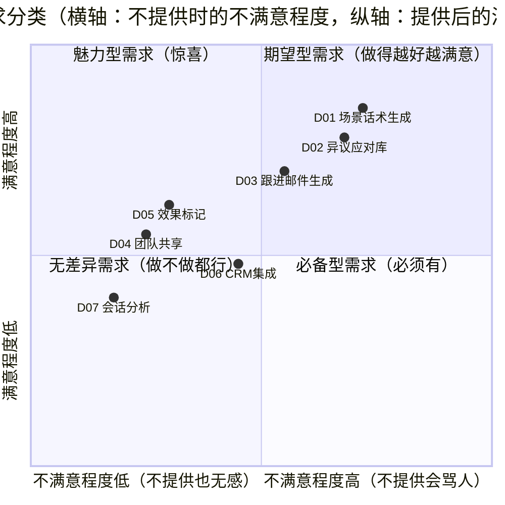

# 02 · 需求分析与优先级

| 文档属性 | 内容 |
|---------|------|
| 所属项目 | SalesMate · AI 销售作战助手 |
| 文档版本 | V1.0 |
| 上游输入 | [01-市场与用户调研](./01-市场与用户调研.md) |
| 下游输出 | [03-产品路线图](./03-产品路线图.md)、[05-PRD](./05-PRD-产品需求文档.md) |

---

## 1. 需求池

来源标注：访谈（深访）、问卷（Q）、竞品分析（竞品）、内部推演（推演）。

| 编号 | 需求描述 | 来源 | 用户原话 / 依据 |
|:---:|---------|:---:|---------------|
| D01 | 按场景（行业/角色/阶段/目标）生成定制话术 | 深访 | “查到的答案匹配不上具体场景” |
| D02 | 客户异议应对策略库 | 深访+Q | 丢单首因 38% 归为异议应对不当 |
| D03 | 跟进邮件自动生成 | 深访 | 日均 1.4 小时写邮件 |
| D04 | 团队话术共享与点赞 | 深访 | 主管希望拉齐团队水位 |
| D05 | 话术效果标记（有效/无效反馈） | 推演 | 需要数据闭环验证话术质量 |
| D06 | CRM 集成（客户数据自动带入） | 深访 | 销售不想二次录入客户信息 |
| D07 | 会话录音分析与复盘报告 | 竞品 | 对标 Gong.io 核心能力 |
| D08 | 赢单概率预测 | 竞品 | 依赖大量过程数据，早期不具条件 |
| D09 | 销售培训课程 | Q | 非软件诉求，不做 |
| D10 | 多语言话术支持 | Q | 出海销售是细分场景，后期考虑 |

## 2. KANO 模型分析

对 45 份问卷做 KANO 分类问卷（正反双向提问），结果如下：

**KANO 结论：**

| 分类 | 需求 | 策略 |
|------|------|------|
| **必备型 + 期望型核心** | D01 场景话术生成 | MVP 必须做，且要做到 15 秒内可用 |
| **期望型** | D02 异议应对、D03 邮件生成 | MVP 内做，构成「作战方案」完整性 |
| **魅力型** | D05 效果标记 | V1.0 轻量版（一键标记），V1.5 完善 |
| **无差异 / 后置** | D04、D06、D07、D08、D09、D10 | 进入路线图排序，MVP 不做 |

## 3. RICE 评估

| 需求 | Reach（季度触达用户%） | Impact（0.25-3） | Confidence（0-1） | Effort（人周） | RICE 得分 | 排序 |
|------|:---:|:---:|:---:|:---:|:---:|:---:|
| D01 场景话术生成 | 90% | 3 | 0.9 | 3 | **81.0** | 1 |
| D02 异议应对库 | 80% | 2 | 0.8 | 2 | **64.0** | 2 |
| D03 跟进邮件生成 | 70% | 2 | 0.8 | 1.5 | **74.7** | 3* |
| D05 效果标记（轻量） | 40% | 1 | 0.6 | 1 | **24.0** | 4 |
| D04 团队共享 | 30% | 1.5 | 0.5 | 4 | 5.6 | 后置 |
| D06 CRM 集成 | 50% | 1 | 0.5 | 6 | 4.2 | 后置 |
| D07 会话分析 | 20% | 2 | 0.3 | 10 | 1.2 | 后置 |

> *D03 得分高于 D02 但排序在后：异议应对与话术生成共享底层引擎（场景参数体系），实现存在依赖关系，D02 先行可摊薄 D03 成本。

## 4. MVP 范围界定

### 4.1 V1.0 做什么（MVP 原则：单点打透，先解决「见客户前 5 分钟」）

- ✅ **FR-001 场景话术生成**：四维场景输入 → 完整作战方案（开场白 / 提问框架 / 价值主张 / 异议预案 / 下一步行动）
- ✅ **FR-002 异议应对库**：12 类高频异议 × 五步应对法，可检索、可订阅
- ✅ **FR-003 跟进邮件助手**：沟通要点 → 结构化邮件草稿，支持语气调节
- ✅ **FR-004 话术收藏夹**：个人维度收藏与历史记录
- ✅ **FR-005 效果标记**：一键标记「用了 / 有效 / 成交」，为 V1.5 数据闭环埋点

### 4.2 V1.0 明确不做什么（写清楚比写「做什么」更重要）

| 不做 | 原因 | 何时做 |
|------|------|-------|
| 团队话术共享 | Top Sales 缺乏沉淀动力，冷启动内容为空 → 无人用 | V1.5，待个人端有话术数据后 |
| CRM 集成 | 需要 BD 资源与对方开放平台权限，MVP 周期不允许 | V1.5 |
| 会话录音分析 | 依赖通话系统对接 + ASR + 合规审查，工作量 10 人周+ | V2.0 |
| 移动端 App | 企微侧边栏形态优于独立 App，V1.0 先以 Web 验证 | V1.5 以企微 H5 形态 |
| 赢单预测 | 过程数据量不足，模型无法训练 | V2.0 之后 |

## 5. 风险预判

| 风险 | 等级 | 应对 |
|------|:---:|------|
| 生成话术「套话感」强，销售觉得没用 | 🔴 高 | Prompt 中注入行业术语与话术风格样本；上线前做 20 人内测对比测试 |
| 客户信息安全疑虑（输入真实客户信息） | 🔴 高 | V1.0 输入项设计为「特征选项」而非「客户实名」；方案见[技术方案 §6](./06-技术方案与内部设计.md#6-安全与合规设计) |
| 生成速度慢导致弃用 | 🟡 中 | 性能指标定为 P95 < 15s，工程侧做流式输出与模板缓存 |

---

*下一篇：[03-产品路线图](./03-产品路线图.md) —— MVP 之后往哪走*
