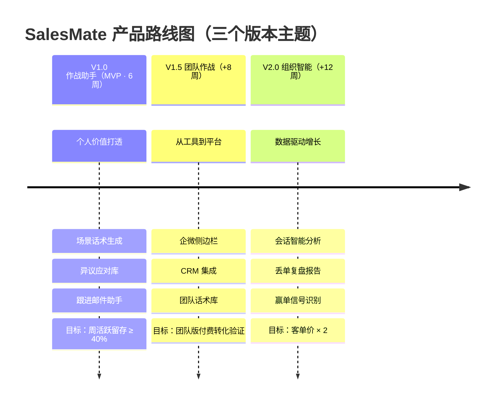
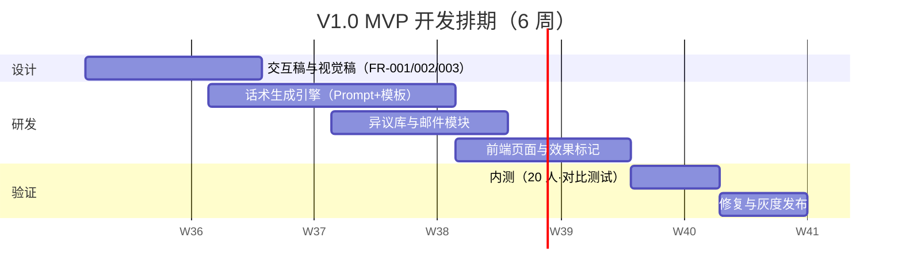

# 03 · 产品路线图

| 文档属性 | 内容 |
|---------|------|
| 所属项目 | SalesMate · AI 销售作战助手 |
| 文档版本 | V1.0 |
| 上游输入 | [02-需求分析与优先级](./02-需求分析与优先级.md) |

---

## 1. 规划原则

1. **价值先行**：每个版本回答一个问题——「用户为什么在这个版本多打开一次」
2. **单点突破 → 数据闭环 → 网络效应**：V1.0 做个人价值，V1.5 做数据沉淀，V2.0 做组织智能
3. **每个版本带一个可度量的北极星目标**，避免功能堆砌

## 2. 路线图总览

## 3. 版本详解

### V1.0 「作战助手」—— 让销售个人离不开

| 维度 | 内容 |
|------|------|
| 版本主题 | 见客户前 5 分钟，拿到一份能直接用的作战方案 |
| 核心功能 | 场景话术生成（FR-001）、异议应对库（FR-002）、跟进邮件（FR-003）、个人收藏与效果标记（FR-004/005） |
| 北极星指标 | **周活跃销售的人均周生成次数**（目标 ≥ 5 次/周） |
| 辅助指标 | 话术采纳率（复制/收藏率）≥ 40%；生成 P95 耗时 < 15s |
| 验证假设 | 「按需生成的场景化话术」比「静态话术手册」显著更好用 |
| 里程碑 | W3 完成生成引擎内测（20 人）→ W5 全功能联调 → W6 灰度发布 |

### V1.5 「团队作战」—— 从个人工具到团队平台

| 维度 | 内容 |
|------|------|
| 版本主题 | 让好话术被看见、被复用，拉齐团队水位 |
| 核心功能 | 团队话术库（基于 V1.0 效果标记数据自动聚合高频有效话术）、企微侧边栏（工作流嵌入）、CRM 集成（客户上下文自动带入，免二次录入） |
| 前置条件 | V1.0 效果标记累计 ≥ 5000 条（保证团队库冷启动有内容） |
| 商业化验证 | 10 人以上团队收取团队版订阅（个人版免费增长漏斗） |
| 风险 | 企微审核周期不确定 → 预留 2 周缓冲；CRM 集成优先做销售易（调研中提及率最高） |

### V2.0 「组织智能」—— 数据驱动销售管理

| 维度 | 内容 |
|------|------|
| 版本主题 | 从「辅助个人」到「读懂战场」 |
| 核心功能 | 会话录音智能分析（ASR + 话术回溯）、丢单自动复盘报告、赢单信号识别（话术特征 → 成交相关性） |
| 数据依赖 | V1.5 团队版沉淀的「话术 → 结果」配对数据 ≥ 5 万条 |
| 竞争卡位 | 对标 Gong.io 核心能力，本土化 + 中文话术理解差异化 |

## 4. V1.0 里程碑甘特图

## 5. 路线图决策记录（ADR）

> **决策 1：V1.0 不做团队共享，即使主管是付费决策者。**
> 原因：话术库冷启动无内容 → 无人使用 → 无数据沉淀 → 永远无内容（死循环）。个人工具的价值可以独立成立，先用免费个人版积累数据与口碑。
>
> **决策 2：企微侧边栏放 V1.5 而非 V1.0。**
> 原因：审核周期与 API 权限不可控，不应阻塞 MVP 验证节奏。V1.0 以 Web 形态快速验证核心假设。

---

*下一篇：[04-用户流程与体验设计](./04-用户流程与体验设计.md) —— 用户怎么用起来*
