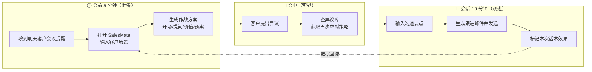
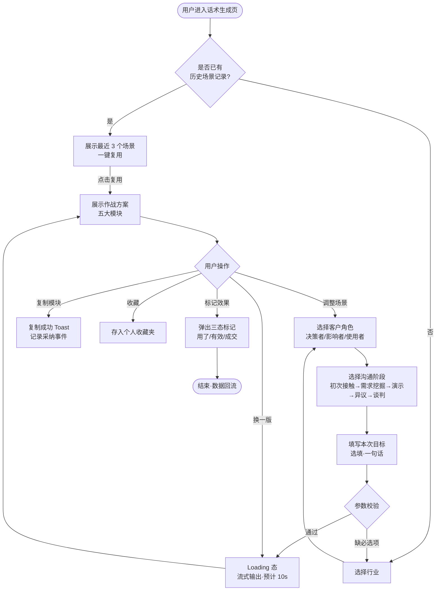

# 04 · 用户流程与体验设计

| 文档属性 | 内容 |
|---------|------|
| 所属项目 | SalesMate · AI 销售作战助手 |
| 文档版本 | V1.0 |
| 上游输入 | [03-产品路线图](./03-产品路线图.md) |
| 下游输出 | [05-PRD](./05-PRD-产品需求文档.md) |

---

## 1. 核心用户旅程总览

销售的一天被切分为三个关键时刻，产品分别介入：



**设计要点**：三个场景共享同一套「场景参数体系」（行业 × 角色 × 阶段 × 异议），用户在会前输入一次，会中与会中场景自动继承，**避免重复输入**是留存的关键。

## 2. 核心流程详解：场景话术生成（FR-001）



**异常流程设计：**

| 异常场景 | 处理方案 |
|---------|---------|
| 生成超时（>15s） | 自动降级为「模板版话术」（本地缓存），并提示「网络繁忙，已切换极速模式」 |
| 生成失败 | 保留已填参数，一键重试；连续 2 次失败展示客服入口 |
| 非常规参数组合（如「制造业 × 谈判阶段 × 使用者」） | 不做硬拦截，生成时在结果顶部标注「该场景组合样本较少，结果仅供参考」 |

## 3. 客户旅程图（Customer Journey Map）

以 Persona 1「新人销售小林」明天要见第一位客户为例：

| 阶段 | 见客户前夜 | 会前 5 分钟 | 客户会面中 | 会后跟进 | 周复盘 |
|------|-----------|------------|-----------|---------|--------|
| **行为** | 翻产品手册、背话术 | 慌张、心跳加速 | 讲解、被问住、被压价 | 硬着头皮写邮件 | 被主管问过程 |
| **触点** | 话术手册(PDF) | 🎯 **SalesMate 话术生成** | 🎯 **SalesMate 异议库** | 🎯 **SalesMate 邮件助手** | 🎯 **效果标记数据** |
| **痛点（Before）** | 资料太多抓不住重点 | 不知道开场说什么 | 异议一来大脑空白 | 写 40 分钟还词不达意 | 讲不清哪里做错了 |
| **情绪（Before）** | 😰 焦虑 | 😱 恐慌 | 😣 挫败 | 😤 疲惫 | 😞 低落 |
| **解决方案（After）** | — | 一份结构化作战方案 | 手机静音查五步应对 | 30 秒出稿·微调发送 | 话术-结果配对数据 |
| **情绪（After）** | — | 🙂 有底 | 😌 从容 | 😊 轻松 | 🙂 成长感 |
| **机会点** | 生成「明日重点」推送 | 一键复用历史场景 | 异议库离线可用 | 邮件模板个性化 | 主管视角团队看板（V2.0） |

## 4. 信息架构与关键页面

### 4.1 V1.0 信息架构

```
SalesMate
├── 首页（作战台）
│   ├── 快捷入口：新建作战方案
│   └── 最近场景（一键复用）
├── 话术生成（核心页）
│   ├── 场景参数区（行业/角色/阶段/目标）
│   └── 结果区（开场白/提问框架/价值主张/异议预案/下一步行动）
├── 异议应对库
│   ├── 12 类异议分类导航
│   └── 异议详情（五步应对 + 话术示例 + 适用场景）
├── 邮件助手
├── 我的
│   ├── 收藏夹
│   ├── 历史记录（含效果标记）
│   └── 设置
```

### 4.2 关键页面设计说明（供设计师 / 研发对齐）

| 页面 | 布局要点 | 状态设计 |
|------|---------|---------|
| 话术生成页 | 上：参数区（4 个选择器 + 1 个选填输入）；下：结果区五大模块卡片，**每模块独立复制按钮** | 空态（引导文案）/ 生成中（流式输出+骨架屏）/ 结果态 / 降级态（模板版标识） |
| 异议库 | 左侧分类导航 + 右侧内容，**支持搜索**；移动端为上下结构 | 无网时展示本地缓存的 Top 3 高频异议 |
| 邮件助手 | 左：要点输入（支持语音转文字，V1.5）；右：邮件预览 | 草稿自动保存（本地 Storage），防丢失 |

**可交互原型**：以上设计已实现为可点击原型 → [`demo/index.html`](../demo/index.html)，演示了话术生成、异议应对、邮件助手三个核心流程。

---

*下一篇：[05-PRD-产品需求文档](./05-PRD-产品需求文档.md) —— 研发可以照着做的精确度*
