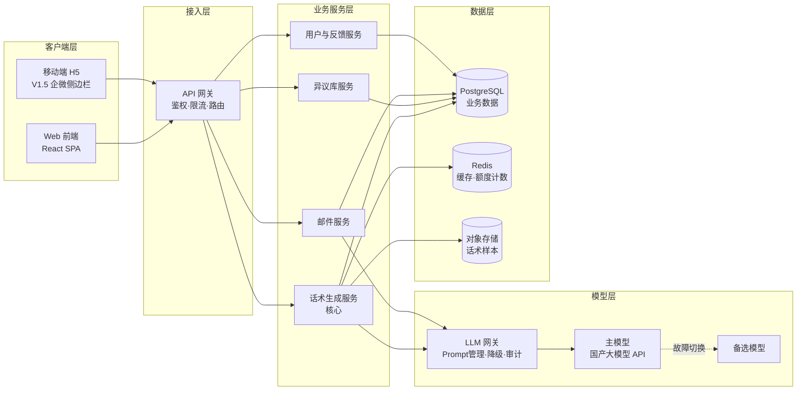
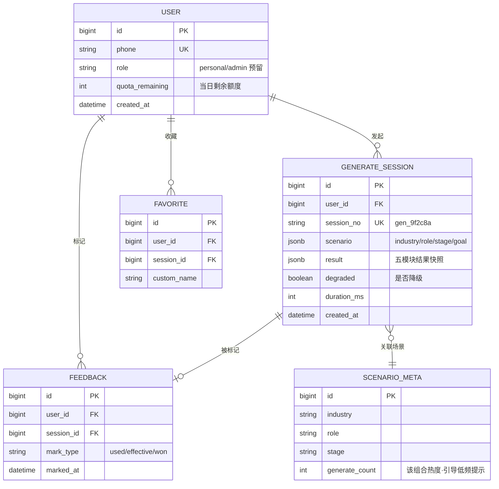
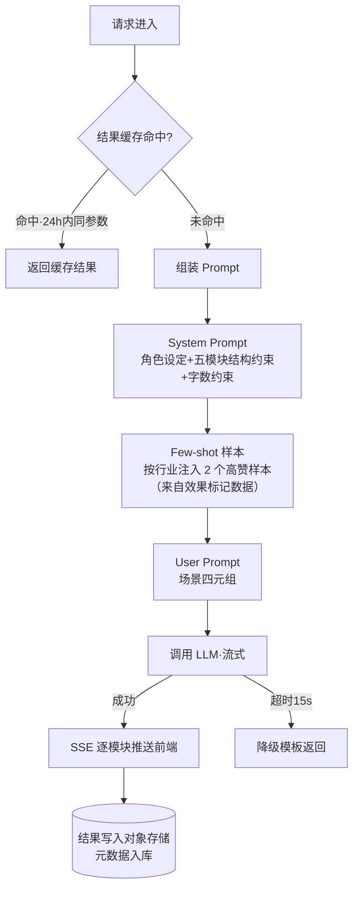

# 06 · 技术方案与内部设计

| 文档属性 | 内容 |
|---------|------|
| 所属项目 | SalesMate · AI 销售作战助手 |
| 文档版本 | V1.0 |
| 文档目的 | 面向研发团队的内部设计方案，供技术评审与排期对齐 |
| 关联文档 | [05-PRD](./05-PRD-产品需求文档.md) |

> **写给研发的说明**：本文档定义了架构边界、接口契约与数据模型。具体实现细节（框架版本、中间件部署参数）由研发在技术评审中确定，本文档不约束。

---

## 1. 架构总览



**架构决策（ADR）：**

| 决策 | 理由 |
|------|------|
| LLM 通过统一网关接入而非直连 | Prompt 集中版本管理（PM 可不改代码调 Prompt）；模型可热切换；统一审计日志 |
| 异议库为独立服务且内容缓存到前端 | 读多写少 + 高频离线场景（会中查异议），本地索引保证 300ms 响应与离线可用 |
| 生成结果不直写数据库 | 结果落对象存储 + 元数据入库，控制 PG 体积；效果标记时才回写结构化数据 |

## 2. 技术选型

| 层 | 选型 | 备选 | 选择理由 |
|----|------|------|---------|
| 前端 | React 18 + Vite | Vue 3 | 生态成熟，团队熟悉度优先 |
| 后端 | Python FastAPI | Node.js NestJS | LLM 生态（SDK、流式 SSE）Python 最顺手 |
| 主数据库 | PostgreSQL | MySQL | JSONB 字段适配话术结构的灵活 schema |
| 缓存 | Redis | — | 额度计数（原子操作）+ 场景结果缓存 |
| LLM | 国产合规大模型 API（如 DeepSeek / 通义） | 自部署开源模型 | 数据合规优先；V2.0 量大后评估自部署降本 |

## 3. 核心 API 设计

### 3.1 接口清单

| 方法 | 路径 | 说明 | 鉴权 |
|:---:|------|------|:---:|
| POST | `/api/v1/scripts/generate` | 生成作战方案（SSE 流式） | ✅ |
| POST | `/api/v1/scripts/regenerate` | 换一版（携带 session_id） | ✅ |
| GET | `/api/v1/scripts/history` | 历史记录（分页 + 筛选） | ✅ |
| POST | `/api/v1/scripts/favorite` | 收藏 / 取消收藏 | ✅ |
| POST | `/api/v1/feedback/mark` | 效果标记 | ✅ |
| GET | `/api/v1/objections` | 异议库全量（含版本号，前端增量同步） | ✅ |
| POST | `/api/v1/emails/draft` | 生成邮件草稿 | ✅ |

### 3.2 关键接口示例：生成作战方案

**Request**

```http
POST /api/v1/scripts/generate
Content-Type: application/json

{
  "industry": "制造业",
  "role": "决策者",
  "stage": "方案演示",
  "goal": "约到决策层汇报会"
}
```

**Response（SSE 流式，逐模块推送）**

```
event: module
data: {"module": "opening", "content": "王总您好，上次听说贵司产线排产..."}

event: module
data: {"module": "questions", "content": ["...", "...", "..."]}

event: done
data: {"session_id": "gen_9f2c8a", "duration_ms": 8400, "degraded": false}
```

**错误码约定**

| HTTP 状态 | 业务码 | 场景 | 前端处理 |
|:---:|:---:|------|---------|
| 200 | — | 成功（含 `degraded: true` 的降级结果） | 降级 Toast |
| 400 | `INVALID_PARAM` | 参数缺失 / 越界 | 表单高亮提示 |
| 429 | `QUOTA_EXCEEDED` | 当日额度用尽 | 引导分享得额度 |
| 503 | `LLM_UNAVAILABLE` | 模型服务不可用 | 自动重试 1 次 → 降级模板 |

## 4. 数据模型



> **设计要点**：`FEEDBACK.mark_type` 与 `GENERATE_SESSION` 的配对关系，就是 V1.5 团队话术库「按效果聚合」和 V2.0「话术-赢单相关性分析」的数据地基。**V1.0 埋下的字段，决定两个版本后能挖出什么。**

## 5. 话术生成引擎设计



**Prompt 管理规范**：

- Prompt 模板存于配置中心（数据库表 `prompt_template`），带 `version` 字段，**支持灰度**：新版本先对 10% 流量生效，对比采纳率后全量
- Few-shot 样本池按「行业 × 采纳率」排序，每日定时任务刷新，**效果标记数据反向提升生成质量**，形成数据飞轮

### 5.1 原型实况对照（V0 Demo · 已落地）

为方便评审对照，列出 Demo 实际跑通的部分（V1.0 生产版待补全）：

| 设计项 | V0 Demo | 实现说明 |
|--------|:------:|---------|
| 场景四元组输入 | ✅ | 行业 / 角色 / 阶段 / 目标四个下拉 + 输入框 |
| System Prompt | ✅ | 内置 `SALESMATE_SYSTEM_PROMPT`：角色设定 + JSON 格式约束 + 风格约束 |
| User Prompt（按 Tab 分模板） | ✅ | 话术 / 异议 / 邮件三个模板分别拼装场景四元组 |
| LLM 调用 | ✅ | 前端直接调 DeepSeek API（OpenAI 兼容），CORS 友好 |
| JSON 容错 | ✅ | `extractJSON()` 处理可能包了 markdown code block 的返回 |
| 失败降级（toast + 切本地） | ✅ | catch 后展示错误信息 + 一键切回本地规则引擎 |
| API Key 安全 | ✅ | 存 `localStorage`，不写仓库，不上传服务器 |
| 三个 Tab 全接 LLM | ✅ | 话术生成 / 异议应对 / 跟进邮件均支持真实 AI，异议还支持任意自定义输入 |
| 结果缓存（24h） | ⏳ V1.0 | 同参数缓存命中直返，节省 token |
| 流式 SSE | ⏳ V1.0 | 逐模块推送，提升首字延迟体感 |
| Few-shot 注入 | ⏳ V1.0 | 按行业注入高赞样本（依赖效果标记数据冷启动） |
| Prompt 灰度 | ⏳ V1.0 | 配置中心 + version 字段 + 10% 流量灰度 |
| 主备模型降级 | ⏳ V1.0 | 主备模型自动切换（依赖双供应商） |

**一句话总结**：设计稿里规划的 **13 个能力点**，原型已落地 **9 个**，剩 4 个依赖真实用户量与数据飞轮（缓存、灰度、Few-shot、降级都需要生产数据反哺）。原型不是临摹设计稿，而是设计稿的**最小可验证子集**——先把"调通 LLM + 写好 Prompt"这两件事坐实，再考虑工程化与放大。

## 6. 安全与合规设计

| 风险 | 措施 |
|------|------|
| 客户敏感信息外泄 | 生成请求**不接收客户实名 / 公司名等可识别信息**（产品侧输入设计为枚举特征 + 脱敏目标描述）；日志层二次正则脱敏 |
| Prompt 注入攻击 | 用户输入的 `goal` 字段做指令过滤（检测「忽略以上指令」类模式）；用户内容与系统指令分层，不拼接 |
| 生成内容合规 | 双敏感词库过滤 + 生成内容显著「AI 生成」标识（合规要求） |
| 额度刷量 | Redis 原子计数 + 手机号验证码登录门槛；异常频次（>50 次/日）触发人机验证 |

## 7. 排期与分工建议（供项目经理 / 研发负责人参考）

| 模块 | 人力 | 工期 | 关键依赖 |
|------|------|------|---------|
| 前端（三页面 + 埋点） | 前端 × 1 | 3 周 | 设计稿 W1 交付 |
| 生成引擎（Prompt + LLM 网关 + 降级） | 后端 × 1 | 2 周 | LLM API 采购 W0 完成 |
| 异议库 + 邮件 + 用户反馈 | 后端 × 1 | 2 周 | — |
| 内容运营（15 类异议 + 样本池冷启动） | 运营 × 1 | 与开发并行 | 业务专家审核资源 |
| 测试 + 灰度 | 全员 | 1 周 | 内测 20 人名单 |

**风险预警**：LLM API 采购与合规审查是关键路径（若走企业采购流程可能 2 周+），建议立项第一周并行启动。

---

*返回 [README](../README.md) · 查看全部作品集文档*
